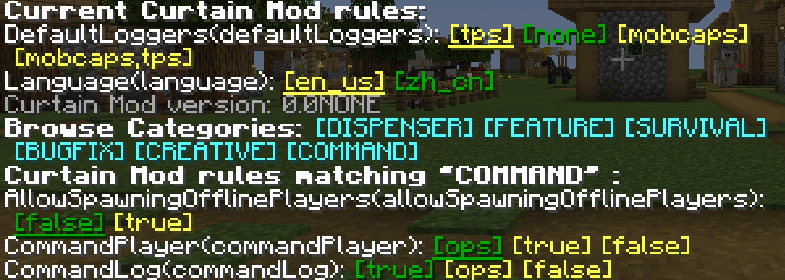

# [Curtain MOD](../README.md) | **窗帘**

类似于[Fabric地毯](https://github.com/gnembon/fabric-carpet)的Forge模组

窗帘模组是一个允许你控制游戏技术选项的Forge模组

* 使用`/log`查看服务器生物生成情况，TPS等
* 使用`/player`控制或生成玩家
* ...

## 怎么使用？

* 按照 [此处](https://forums.minecraftforge.net/topic/89239-excessively-asked-questions-eaq/)
  的步骤安装Forge，并将`curtain...jar`放入`mods`文件夹。
* 使用`/curtain`命令以打开窗帘模组主菜单。
    * 
* 点击彩色按钮来启用或关闭窗帘规则。

## 窗帘模组规则

* [此处](RULES.md)

## 基于

* [Fabric Carpet](https://github.com/gnembon/fabric-carpet)
* [GCA](https://github.com/Gu-ZT/gugle-carpet-addition)
* [PCA](https://github.com/plusls/plusls-carpet-addition)
* [Carpet TIS Addition](https://github.com/TISUnion/Carpet-TIS-Addition)
